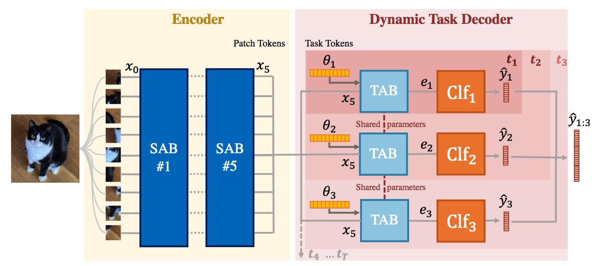
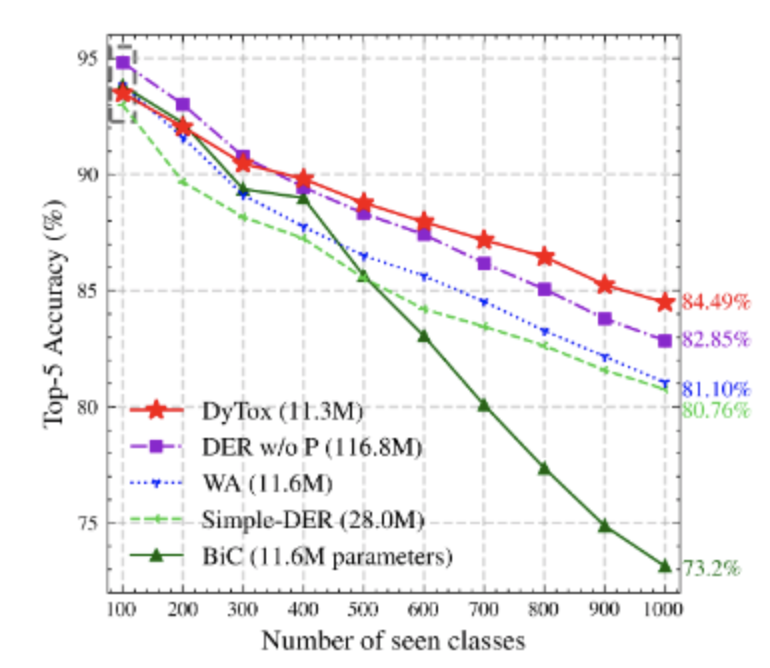
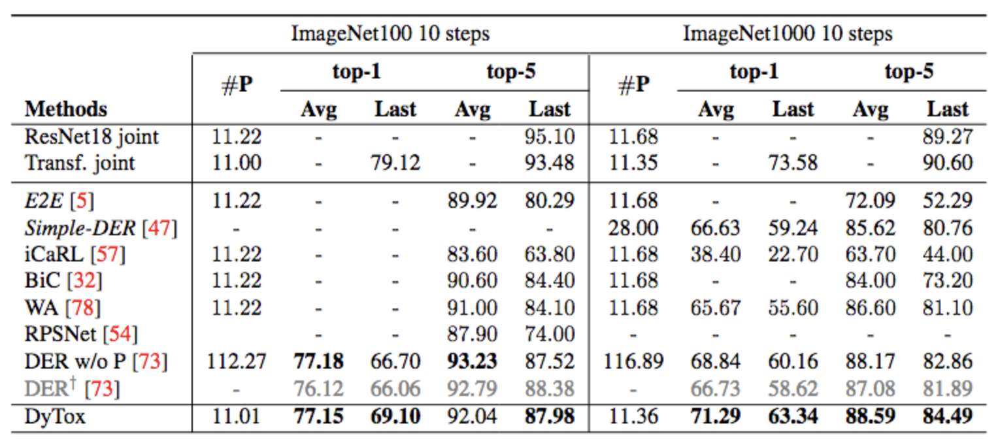
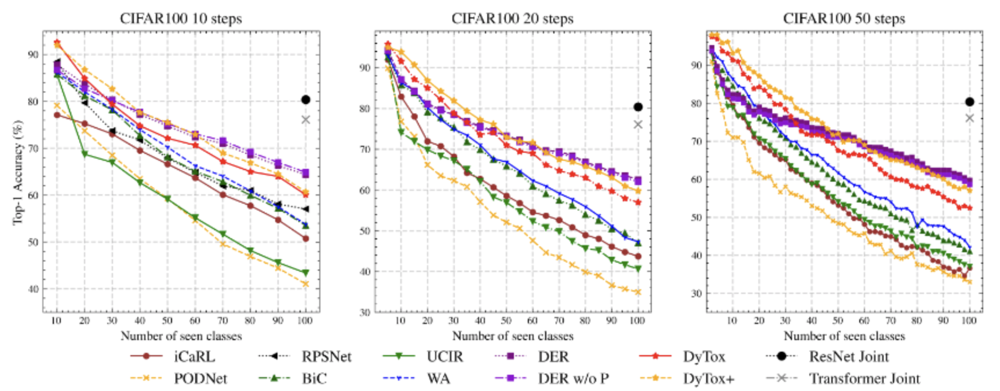
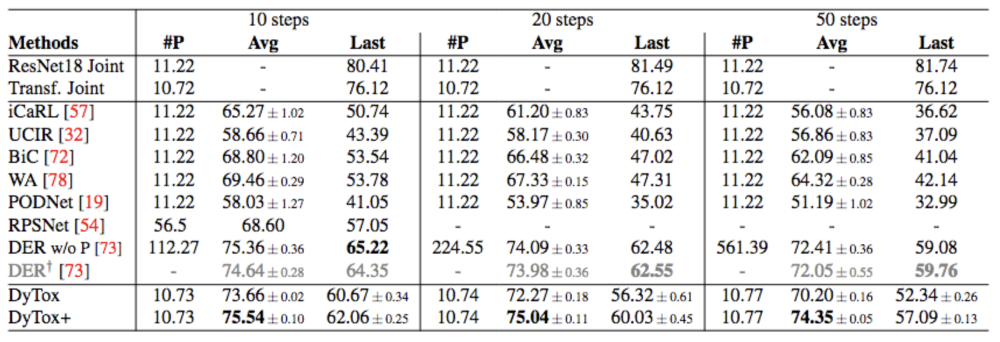

<div align="center">

# DyTox

## Transformers for Continual Learning with DYnamic TOken eXpansion

[](https://arxiv.org/abs/2111.11326)

[](https://www.youtube.com/watch?v=O1GNm4WdrNw)



Welcome to DyTox, the first transformer designed explicitly for Continual Learning!
</div>


Work led by [Arthur Douillard](https://arthurdouillard.com/) and co-authored with [Alexandre Ramé](https://alexrame.github.io/),
[Guillaume Couairon](https://phazcode.gitlab.io/about/), and [Matthieu Cord](http://webia.lip6.fr/~cord/).


# Installation

You first need to have a working python installation with version >= 3.6.

Then create a conda env, and install the libraries in the `requirements.txt`: it
includes pytorch and torchvision for the building blocks of our model. It also
includes continuum for data loader made for continual learning, and `timm`.

Note that this code is heavily based on the great codebase of [DeiT](https://github.com/facebookresearch/deit).

# Launching an experiment

CIFAR100 dataset will be auto-downloaded, however you must download yourself
ImageNet.

Each command needs three options files:
- which dataset you want to run on and in which settings (i.e. how many steps)
- Which class ordering, by default it'll be 0->C-1, but we used the class ordering
  proposed by DER (and which all baselines also follow)
- Which model version you want (DyTox, DyTox+, and DyTox++ (see supplementary
  about that last one))

To launch DyTox on CIFAR100 in the 50 steps setting on the GPUs #0 and #1:

```bash
bash train.sh 0,1 \
    --options options/data/cifar100_2-2.yaml options/data/cifar100_order1.yaml options/model/cifar_dytox.yaml \
    --name dytox \
    --data-path MY_PATH_TO_DATASET \
    --output-basedir PATH_TO_SAVE_CHECKPOINTS
```

Folders will be auto-created with the results at
`logs/cifar/2-2/{DATE}/{DATE}/{DATE}-dytox`.

Likewise, to launch DyTox+ and DyTox++, simply change the options. It's also the
same for datasets. Note that we provided 3 different class orders (from DER's
implem) for CIFAR100, and we average the results in our paper.

When you have a doubt about the options to use, just check what was defined in the
yaml option files in the folder `./options`.

# Resuming an experiment

Some exp can be slow and you may need to resume it, like for ImageNet1000.

First locate the checkpoints folder (by default at `./checkpoints/` if you didn't
specify any `output-basedir`) where your experiment first ran. Then run the
following command (I'm taking ImageNet1000 as an example but you could have
taken any models and datasets):

```bash
bash train.sh 0,1 \
    --options options/data/imagenet1000_100-100.yaml options/data/imagenet1000_order1.yaml options/model/imagenet_dytox.yaml \
    --name dytox \
    --data-path MY_PATH_TO_DATASET \
    --resume MY_PATH_TO_CKPT_FOLDER_OF_EXP \
    --start-task TASK_ID_STARTING_FROM_0_OF_WHEN_THE_EXP_HAD_STOPPED
```

# Results

## ImageNet




## CIFAR100




# Frequenly Asked Questions

> Is DyTox pretrained?

- No! It's trained from scratch for fair comparison with previous SotAs

> Your encoder is made actually of ConVit blocks, can I use something else? Like a MHSA or Swin?

- Yes! I've used ConVit blocks because they trained well from scratch on small datasets like CIFAR

> Can I add a new datasets?

- Yes! You can add any datasets in [continual/datasets.py](https://github.com/arthurdouillard/dytox/blob/main/continual/datasets.py). They just need to be compatible with the [Continuum](https://github.com/Continvvm/continuum) library. But check it out, they have a lot of [implemented datasets](https://continuum.readthedocs.io/en/latest/tutorials/datasets/dataset.html)

> Could I use a convolution-based backbone for the encoder instead of transformer blocks?

- Yes! You'd need to modify the [DyTox module](https://github.com/arthurdouillard/dytox/blob/main/continual/dytox.py). I already provide several [CNNs](https://github.com/arthurdouillard/dytox/tree/main/continual/cnn). Note that for best results, you may want to remove the ultimate block of the CNN and add strides so that the spatial features are big enough at the end to make enough "tokens"

> Do I need to install nvidia's apex for the mix precision?

- No! DyTox uses Pytorch native mix precision

> Can I run DyTox on a single GPU instead of two?

- In theory, yes. Although the performance is a [bit lower](https://github.com/arthurdouillard/dytox/issues/2). I'll try to find the root cause of this. But on two GPUs the results are perfectly reproducible.

> What is this finetuning phase?

- New classes data is downsampled to the same amount of old classes data stored in the rehearsal memory. And the encoder is frozen. You can see which modules are frozen in which task in the [options files](https://github.com/arthurdouillard/dytox/blob/main/options/model/cifar_dytox.yaml#L35-L36). 


# Citation

If you compare to this model or use this code for any means, please cite us! Thanks :)

```
@inproceedings{douillard2021dytox,
  title     = {DyTox: Transformers for Continual Learning with DYnamic TOken eXpansion},
  author    = {Douillard, Arthur and Ram\'e, Alexandre and Couairon, Guillaume and Cord, Matthieu},
  booktitle = {Proceedings of the IEEE Conference on Computer Vision and Pattern Recognition (CVPR)},
  year      = {2022}
}
```
