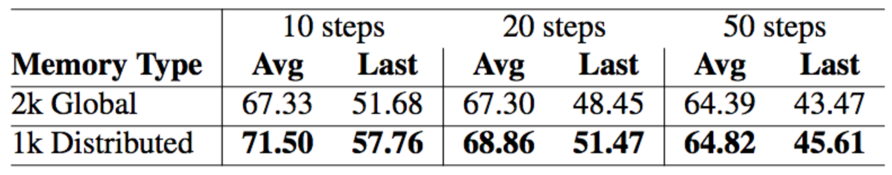
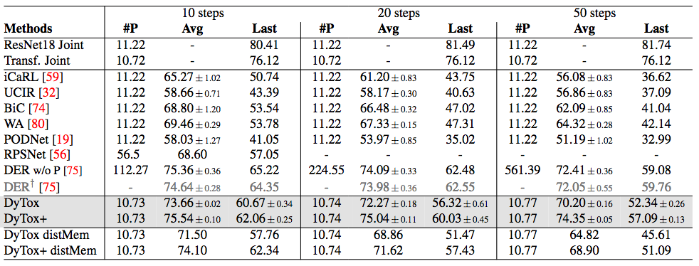
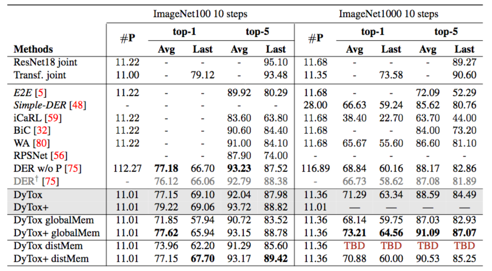

# Erratum

An unexpected behavior of the code in multiple GPUs was raised in [issue #5](https://github.com/arthurdouillard/dytox/issues/5).

DyTox's paper results were run on multiple GPUs (2 for CIFAR, 2 or 4 for ImageNet100, and 4 or 8 for ImageNet1000).

# Distributed Memory vs Global Memory

In Continual Learning, usually features are extracted once from images without data augmentations,
and a procedure (random, closest, or even iCaRL iterative selection) is applied to select rehearsal images.
We call that **Global Memory**.

In DyTox, we actually extracted features with data augmentations, and furthermore *each GPU extracted features
using their own sligthly different data augmentations*. As a result, each GPU could select different
samples, and thus the effective memory size (across all processes) could be up to N times bigger
than asked, with N the number of GPUs. We call that **Distributed Memory**.

Therefore, DyTox's results in the paper, while interesting, are not exactly comparable to the compared baselines.
This document acts as an erratum, and an erratum will also be put in the arXiv that we'll update later.

That said, we believe that this Distributed Memory have merits.

# Interests of the Distributed Memory

1. In the first place, it has similarity with the Federated Learning litterature. In our case, each process/gpu/machine has access to its own memory. Which would make sense, as more machines would also mean a bigger disk storage.

2. Because each GPU extracts with different data augmentations, the overlap of chosen among GPUs is very low: on CIFAR100 with 2 GPUs, the overlap is usually between 1% and 10%. This means that very representative/useful examples will be selected twice (and thus seen more often). But also that each GPU, because of the iterative nature of the rehearsal gathering of iCaRL, will select data belonging to *different modes*, leading to increased **diversity**.

It results in a direct gain of performance on CIFAR:

# Results

Here are the updated results. Global Memory uses 20 samples per class in *total* (as other baselines), Distributed Memory also uses 20 samples per class, but split across GPUs. e.g. on CIFAR100 with 2 GPUs, each GPU only samples 10 samples per class at most. So the overall effective memory size constraint is respected.

**Overall, DyTox keeps strong performance, more often than not above WA the third contender.**
**Moreover, DyTox+, our improved version also presented in the paper still reaches excellent performance, due to the forgetting reduction we explained in our paper.**

Gray color symbolizes results presented in the original paper.

## CIFAR100

CIFAR experiments were run on 2 GPUs. All are with distributed memory.

## ImageNet

ImageNet experiments in global memory were run with 8 GPUs, and with distributed memory with 4 GPUs (thus only 5 images/class/gpu which probably explains here the slightly lower results compared to global memory).

# 1 GPU

We are still trying to improve results on a single GPU for those who cannot have multiple GPUs. See the `--rehearsal-modes` option, very WIP, in the code to emulate some kind of distributed memory.
